Was compiling a post on Messi and Suarez but now Messi isn't leaving and nobody cares about Suarez so whatever, here it is anyway.

## What are we looking at: Suarez

Suarez isn't that good anymore with his numbers falling close to and on both sides of the median for players in his position. His numbers are heavily from the La Liga though so he may still do well in an easier league to compete in, say at Ajax.

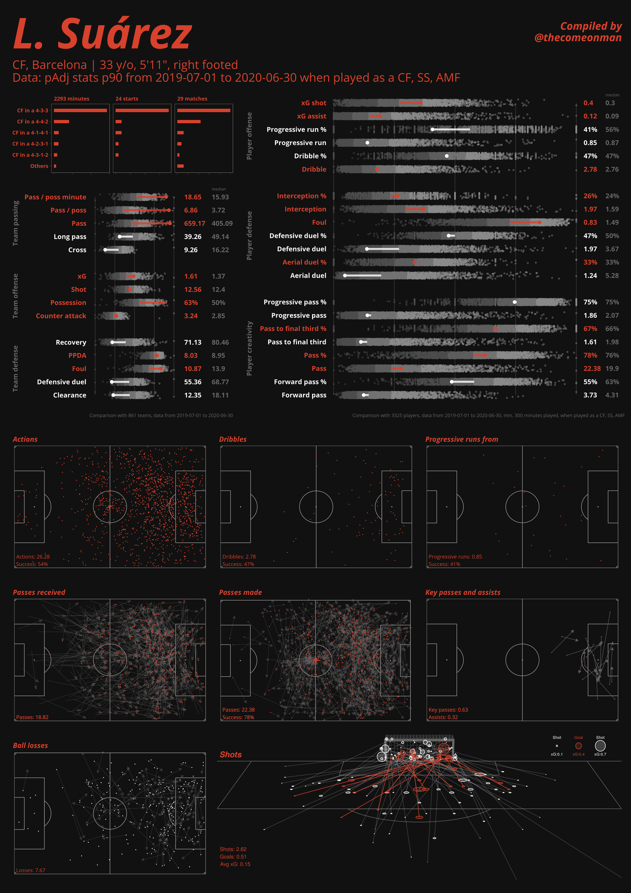

Suarez's numbers have declined significantly over these three years though. His attacking contribution was significantly high and almost all his other key numbers have dipped by a little bit since then. 

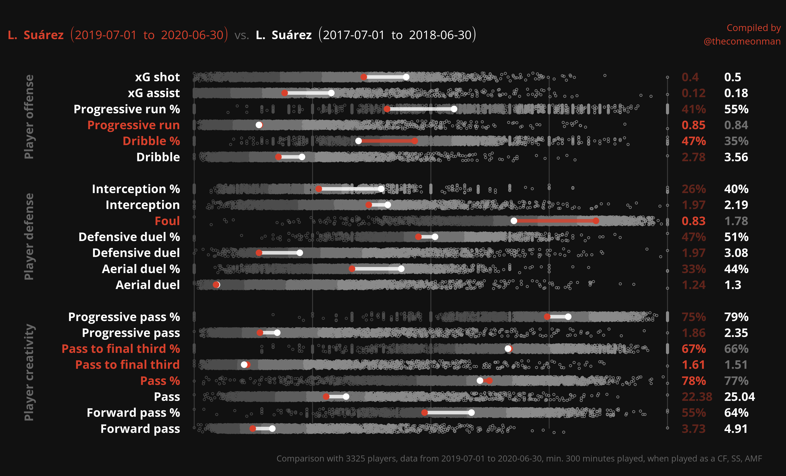

Given his current numbers, now would be a good time to replace him or at least demote him to playing back up to a younger player who can contribute at the level a team like Barcelona need.

## What are we looking at: Messi

Good players will usually fall in the very high percentiles sort of range for a few statistics. On the other hand, most of Messi's attacking and creative numbers are significantly beyond the median for players in similar roles as him showing him to still be in a different league by himself.

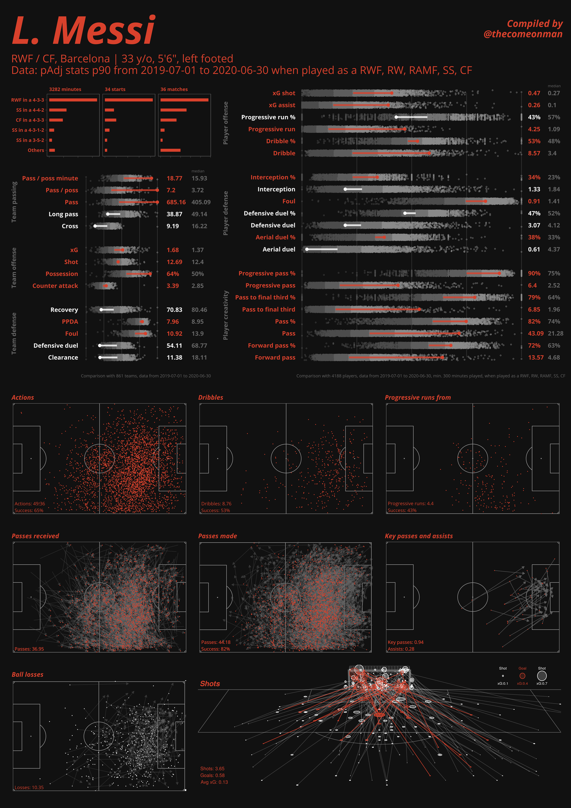

Messi's numbers have dropped marginally in these three years but not that much for a 33 year old. Messi may still have some more time of his quality of football to offer.

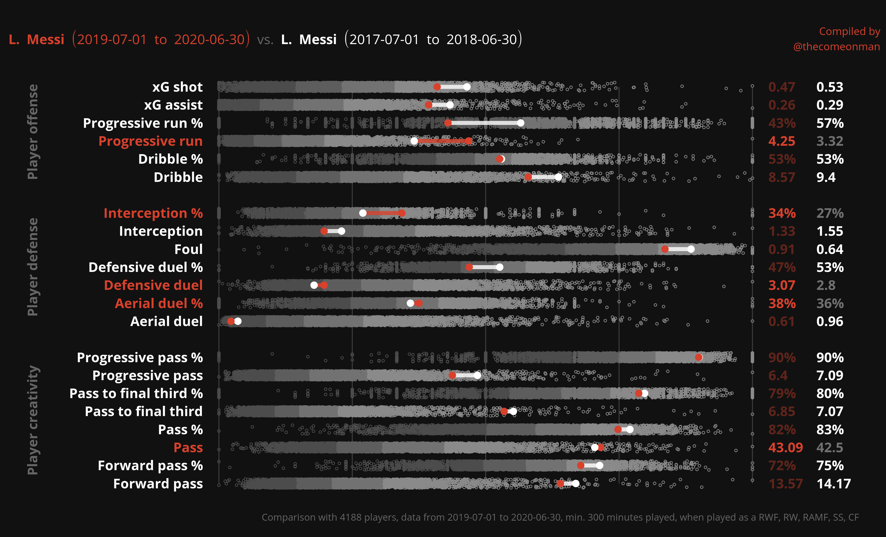

## Finding replacements

I ran my player replacement model for both of them. I ran six runs in total, each player X each of their last 3 years = 2 X 3 = 6. The top 20 players in each list were  considered shortlisted for that respective list.

The sample set considered was from the performance of the players in the 2019-20 time period. Messi's replacement candidates were amongst all players who've played sufficient minutes in RWF, RW, RAMF, SS, CF positions. Suarez's candidates amongst CF, SS, AMF. Two basic filters to rule out very unlikely targets: Transfermrkt value > 10m, age <= 28. That already eliminates quite a large number of players but we aren't bargain hunting so we might as well not waste ( computational ) time on them.

PS: No adjustment for league strength yet. This remains ever present in my to do list.

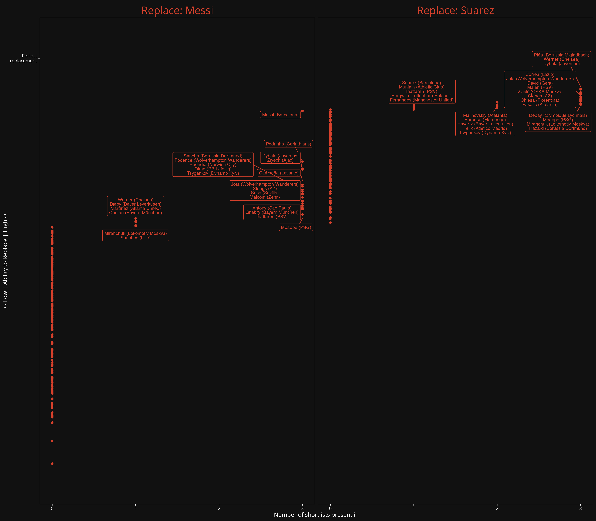

( Just in case you find it odd - there are no players on only two shortlists for Messi. They are either in all three or in just one. )

Observations from the shortlists:
- Messi, and this is the hot data driven take of the post, is going to be hard to replace. Messi in 19-20 comes the closest to replacing Messi in all three years. Amongst the reasonable suggestions, Dybala and Ziyech are a distant almost joint second.
- Suarez has lots of players who come close to replacing him in his three years. Suarez in 19-20 himself makes only one of his three shortlists, the 19-20 one itself. His 19-20 numbers did not make the shortlist for his list for the previous years. This again emphasises his decline.
- Mbappe, Dybala, Stengs, and Jota the only players to appear in all 6 shortlists.
- Werner, Ittaharen, Tsygankov, Miranchuk are the only other players that make at least one shortlist for both Messi and Suarez.
- Lots of recent transfers, such as Ziyech, Werner, Havertz, David, and Antony show up strongly on these lists. We all have our regrets.
- On the bright side, some other transfer rumour names are here - Sancho, Olmo, and finally the strongest Barcelona transfer rumour himelf - Depay, who makes all three of Suarez's shortlists. 

## Realistic transfer target: Depay

The most concrete rumour of these until now has been Depay. Depay isn't an out and out CF, and plays farther away from goal compared to Suarez. Compared to 19-20 Suarez, he runs, dribbles, and creates a lot more but has marginally lower total xG from his shots adjusted for possession. This makes sense given he often plays as a false nine with the wingers playing ahead of him. He could additionally be played on the  wing too, if the need be.

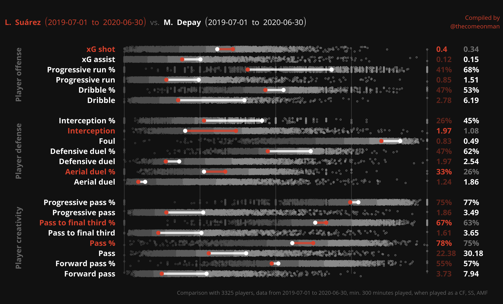
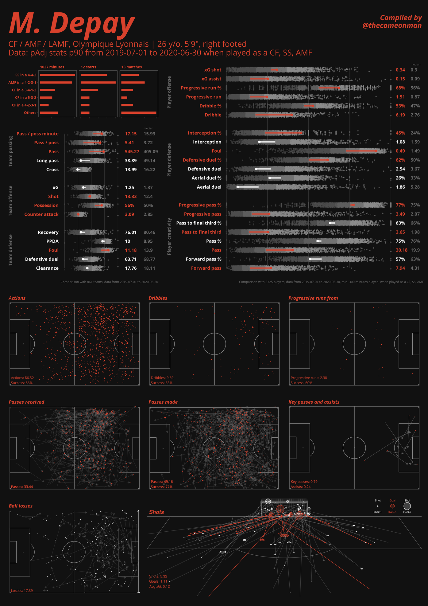

## Realistic transfer target: Dybala

Given the snippets of Dybala not being happy at Juventus that pop up frequently, I'm surprised this isn't yet a transfer rumour.

One time heir to Messi, Dybala's similarity to Messi is obvious. Both are left footed players who play on the right and like to move inside, create for others or shoot, run, dribble. Dybala's numbers don't come very close to Messi's but that's an unrealistic expectation from anyone.

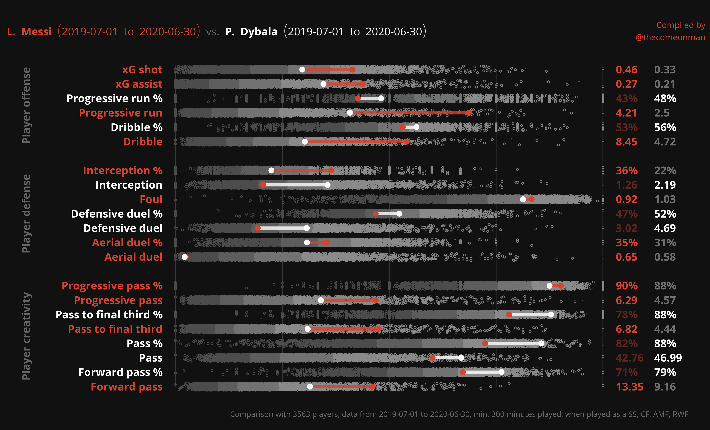

Dybala in 2019-20 played more of an AMF or SS role in Sarri's 4-3-1-2 and not as much as an RWF  but you can still spot similarities in their tendency to play tucked in on the right, their ability to run from the midfield, dribble high up the pitch, and play vertical and diagonal passes into the box.

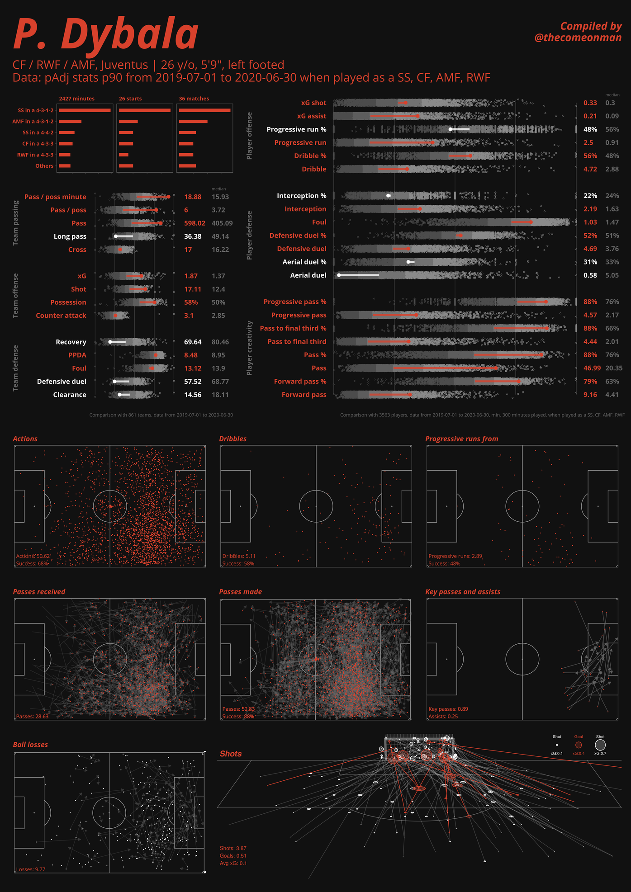

He also showed up in all of Suarez's shortlists which makes him a good hedged bet from Barcelona's point of view.

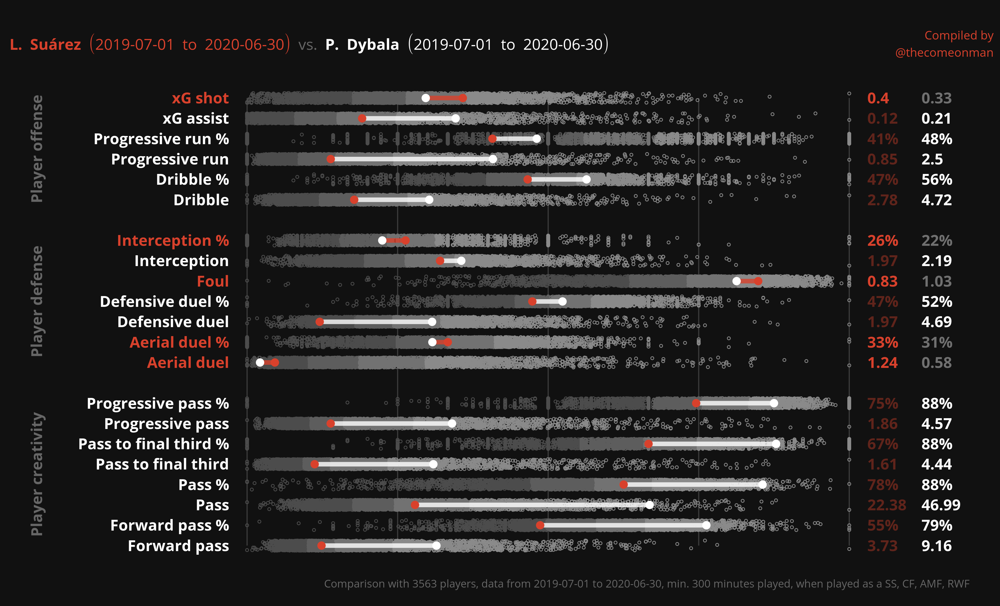

## Realistic transfer target: Sancho

Another player that I'm surprised Barca aren't linked with. He is very versatile when it comes to where he can be positioned on the pitch, he's already playing at a very high level, and he's very young. That should be enough, right?

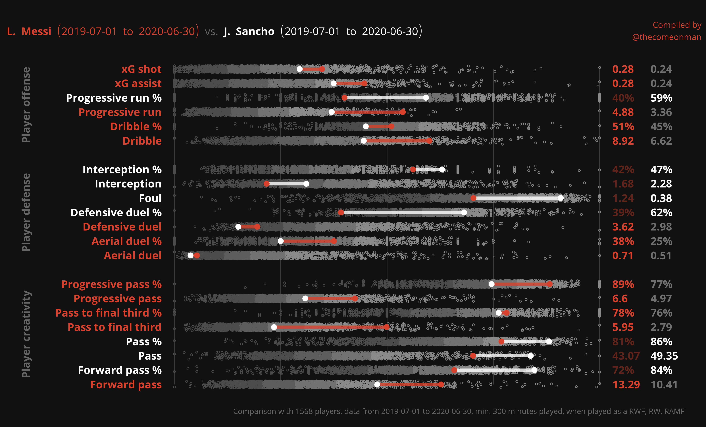

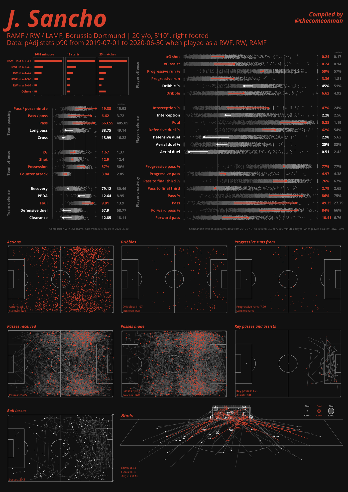

When playing on the right wing, Sancho tends to stay wide with lots of cutbacks and short crosses, and shots from wider angles compared to Messi who prefers more central areas to attempts assists from, often through vertical passes, and to attempt shots from. Barca's style of play today has the width being provided by their fullbacks and the wingers tucked in so if Sancho were to brought in to play on the right wing, it would need a restructuring of the way Barcelona play.

## Get in touch

If you liked this bit of analysis, would like to do it for players at your clubs, or have any feedback, you can find me on [Twitter](https://twitter.com/thecomeonman) or e-mail me at mail dot thecomeonman at gmail dot com.